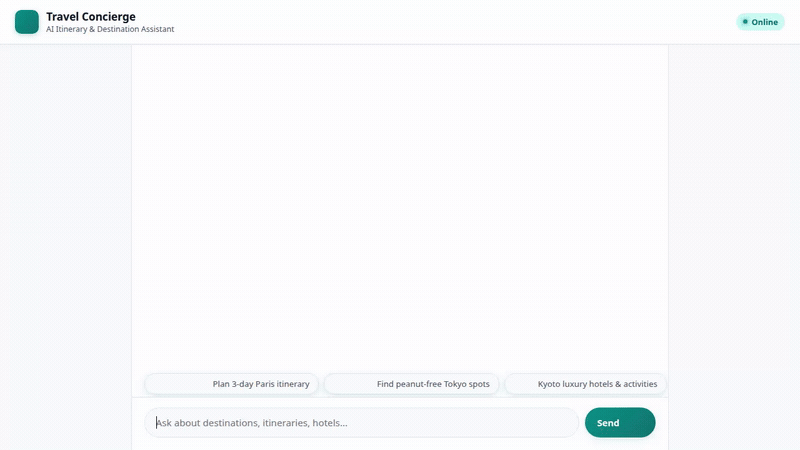

# Travel Concierge

> **AI-Powered Travel Itinerary, Destination & Postcard Assistant**
>
> ***Built in Google's Antigravity*** 

<p align="center">
  
</p>

*Watch full recorded demo with audio: [demo.mp4](demo.mp4)*

---

## Verified Capabilities & Implemented Tools

The following capabilities and tools are fully implemented in code within `app/`:

### 🧠 Persistent Memory & Allergy Guardrails
* **Memory Bank (`PreloadMemoryTool`)**: Automatically saves and preloads user allergies (e.g., peanut, dairy, environmental), dietary restrictions, and travel preferences across session boundaries. The agent checks preloaded memories before recommending food spots or activities to ensure safety.

### 🗄️ Database & Catalog Management
* **Google Cloud Firestore Database**: Stores and retrieves travel destination catalog items.
  * `search_destinations`: Searches Firestore catalog for destination records by name or tags.
  * `get_destination_details`: Retrieves comprehensive destination records from Firestore.
  * `add_destination`: Adds new destination entries into the Firestore collection.
  * `save_travel_itinerary`: Persists generated travel itineraries into Firestore.

### 🖼️ Visual & Media Generation
* **Vertex AI Imagen (`generate_destination_image`)**: Generates travel image postcards for destinations using `imagen-3.0-generate-002`, saves them via ADK `tool_context.save_artifact`, and uploads in-memory bytes to a public Google Cloud Storage (GCS) bucket.
* **Vertex AI Omni Video (`generate_destination_video`)**: Generates short video destination previews using `gemini-omni-flash-preview` in the `global` region, saves ADK artifacts, and uploads in-memory MP4 bytes to public GCS.
* **Google Cloud Storage (GCS)**: Direct in-memory upload of generated images and videos to public bucket (`travel-concierge-assets-qwiklabs-gcp-01-68eca9383e32`) returning public HTTPS URLs (`https://storage.googleapis.com/...`).

### 🌐 Live External APIs & Geolocation
* **Google Maps Geocoding (`geocode_address`)**: Converts landmark addresses to exact latitude/longitude coordinates via Google Maps API.
* **Google Maps Places (`find_nearby_places`)**: Finds nearby points of interest, restaurants, or attractions around specified coordinates.
* **Real-time Weather (`get_live_destination_weather`)**: Queries live weather forecasts and temperatures via the Open-Meteo API.
* **Currency Converter (`convert_currency`)**: Calculates live currency conversions across international currencies via `open.er-api.com`.

### 💻 Code Execution & Rich UI Rendering
* **Agent Engine Sandbox Code Executor**: Safely executes Python code inside an isolated sandbox for budget computations, cost breakdowns, or data analysis.
* **A2UI Structured Component Rendering**: Renders responses into rich A2UI cards (Card, Column, Row, Text, Image) via `A2uiSchemaManager` (v0.8).

---

## Project Structure

```
travel-concierge/
├── app/
│   ├── agent.py               # Root agent definition, Gemini model setup & tool registry
│   ├── tools.py               # Implemented tools (Firestore, GCS, Weather, Maps, Imagen, Omni)
│   ├── a2ui_utils.py          # A2UI callback handlers and response formatting
│   └── prompt.py             # Base system instructions
├── frontend/
│   ├── main.py                # FastAPI proxy server connecting to ADK Agent Engine
│   └── static/
│       └── index.html         # Custom web UI with A2UI renderer & prompt chips
├── demo.gif                   # Looping demo recording
├── demo.mp4                   # Original MP4 demo video recording with lo-fi audio
├── agents-cli-manifest.yaml   # Agent deployment manifest configuration
└── requirements.txt           # Python dependencies
```

---

## Setup & Local Run Instructions

### Prerequisites
* Python 3.10+
* Google Cloud SDK (`gcloud` CLI)
* GCP Project with Vertex AI, Firestore, and Cloud Storage enabled

### 1. Install Dependencies
Navigate to the project directory and install required Python packages:
```bash
cd travel-concierge
pip install -r requirements.txt
```

### 2. Configure Environment Variables
Set your Google Cloud Project ID and Google Maps API Key:
```bash
export GOOGLE_CLOUD_PROJECT="qwiklabs-gcp-01-68eca9383e32"
export MAPS_API_KEY="YOUR_GOOGLE_MAPS_API_KEY"
```

### 3. Start Local Frontend Proxy
Run the FastAPI frontend server locally from the `frontend/` directory:
```bash
cd frontend
python main.py
```
The server will start locally on port 8080. You can access the interface in your web browser by navigating to `http://localhost:8080`.

### 4. Deploying to Agent Platform & Cloud Run
To deploy the agent runtime and web frontend to Google Cloud Platform:

1. **Deploy Agent Runtime**:
   ```bash
   agents-cli deploy --update-env-vars MAPS_API_KEY=$MAPS_API_KEY
   ```

2. **Deploy Frontend Service to Cloud Run**:
   ```bash
   cd frontend
   gcloud run deploy travel-concierge-frontend \
     --source . \
     --region us-east1 \
     --allow-unauthenticated \
     --set-env-vars AGENT_ENGINE_RESOURCE_NAME="projects/276969608347/locations/us-east1/reasoningEngines/6238398078559191040",AGENT_DIRECTORY="app"
   ```

---

## Status of Brief Features

| Feature | Implementation Status |
| :--- | :--- |
| **Itinerary Planning & Preferences** | Implemented (`app/agent.py`) |
| **User Memory & Allergy Guardrails** | Implemented (`PreloadMemoryTool`) |
| **Firestore Destination Catalog & Itineraries** | Implemented (`app/tools.py`) |
| **Imagen 3 Image Postcards & GCS Upload** | Implemented (`generate_destination_image`) |
| **Gemini Omni Video Previews & GCS Upload** | Implemented (`generate_destination_video`) |
| **Live Weather & Currency Conversion** | Implemented (`app/tools.py`) |
| **Google Maps Geocoding & Places** | Implemented (`app/tools.py`) |
| **Direct Flight Booking API** | *Planned, not yet implemented* |
| **Hotel Checkout Reservation API** | *Planned, not yet implemented* |
